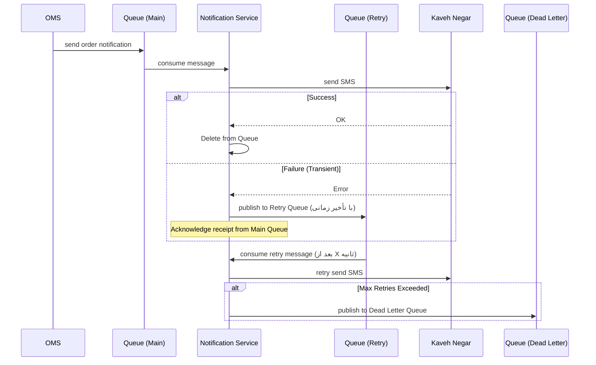

```mermaid
sequenceDiagram
    participant OMS
    participant Q1 as Queue (Main)
    participant S2 as Notification Service
    participant Q2 as Queue (Retry)
    participant K as Kaveh Negar
    participant Q3 as Queue (Dead Letter)

    OMS ->> Q1: send order notification
    Q1 ->> S2: consume message
    S2 ->> K: send SMS
    
    alt Success
        K -->> S2: OK
        S2 ->> S2: Delete from Queue
    else Failure (Transient)
        K -->> S2: Error
        S2 ->> Q2: publish to Retry Queue (با تأخیر زمانی)
        Note over S2: Acknowledge receipt from Main Queue
    end
    
    Q2 ->> S2: consume retry message (بعد از X ثانیه)
    S2 ->> K: retry send SMS
    
    alt Max Retries Exceeded
        S2 ->> Q3: publish to Dead Letter Queue
    end
```