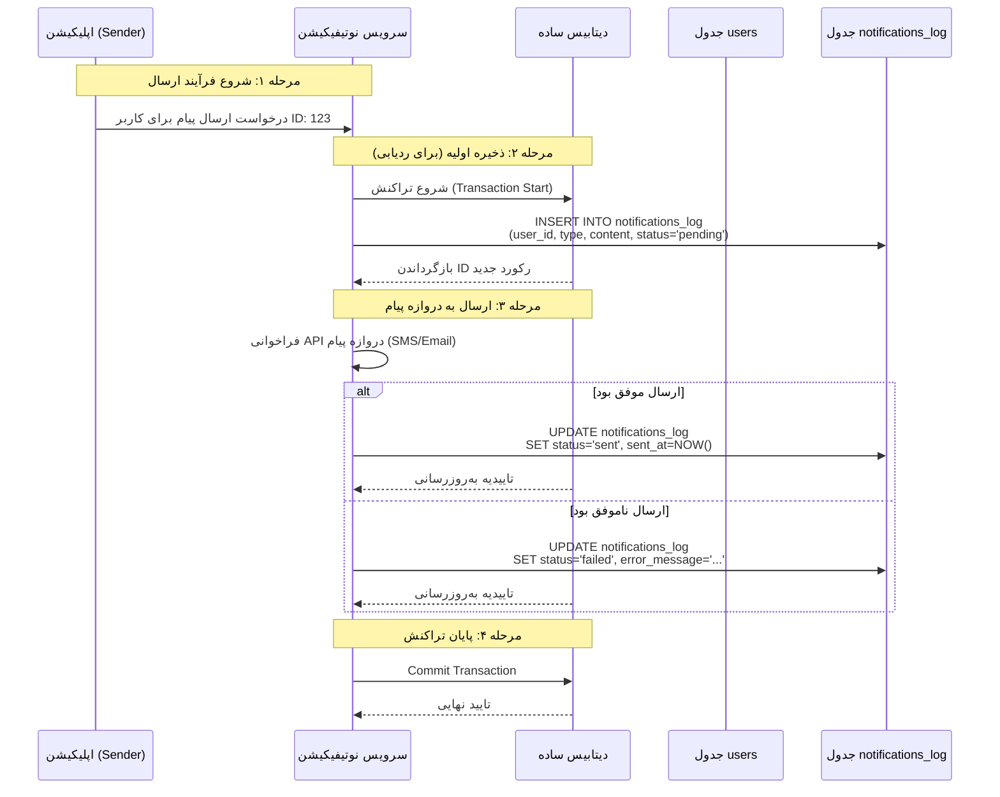

```mermaid
sequenceDiagram
    participant App as اپلیکیشن (Sender)
    participant NotifService as سرویس نوتیفیکیشن
    participant DB as دیتابیس ساده
    participant UsersTable as جدول users
    participant LogTable as جدول notifications_log

    Note over App, NotifService: مرحله ۱: شروع فرآیند ارسال
    App->>NotifService: درخواست ارسال پیام برای کاربر ID: 123
    
    Note over NotifService, DB: مرحله ۲: ذخیره اولیه (برای ردیابی)
    NotifService->>DB: شروع تراکنش (Transaction Start)
    NotifService->>LogTable: INSERT INTO notifications_log<br/>(user_id, type, content, status='pending')
    DB-->>NotifService: بازگرداندن ID رکورد جدید

    Note over NotifService, DB: مرحله ۳: ارسال به دروازه پیام
    NotifService->>NotifService: فراخوانی API دروازه پیام (SMS/Email)
    
    alt ارسال موفق بود
        NotifService->>LogTable: UPDATE notifications_log<br/>SET status='sent', sent_at=NOW()
        DB-->>NotifService: تاییدیه به‌روزرسانی
    else ارسال ناموفق بود
        NotifService->>LogTable: UPDATE notifications_log<br/>SET status='failed', error_message='...'
        DB-->>NotifService: تاییدیه به‌روزرسانی
    end

    Note over NotifService, DB: مرحله ۴: پایان تراکنش
    NotifService->>DB: Commit Transaction
    DB-->>NotifService: تایید نهایی
```