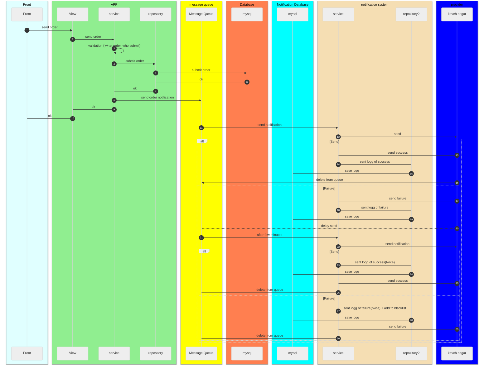

```mermaid
---
config:
  theme: neutral
  themeVariables:
    primaryColor: '#4f96e7ff'
    primaryBorderColor: 'rgba(153, 188, 241, 1)'
    lineColor: '#F8B229'
---
sequenceDiagram
    autonumber

    box LightCyan Front
        participant OMS as Front
    end

    box LightGreen APP
        participant API as View
        participant service as service
        participant repository as repository
        
    end

    box yellow message queue
        participant Q as Message Queue
    end

    box Coral Database
        participant DB as mysql
    end
    
    box cyan Notification Database
        participant DB2 as mysql
    end
    
    
    box Wheat notification system
        participant service2 as service
        participant repozitory2 as repozitory2
    end

    box blue provider
        participant k as kaveh negar
    end

    OMS ->> API: send order
    API ->> service : send order
    service ->> service : validation { what order, who submit}
    service ->> repository : submit order
    repository ->> DB : submit order
    DB -> repository: ok
    repository -> service : ok 
    service ->> Q : send order notification
    service -> API : ok
    API -> OMS: ok
    
    
    Q ->> service2 : send notification
    
    service2 ->> k : send
    
    
    
    
    alt Send
        k -> service2 : send success
        service2 -> repozitory2 : sent logg of success 
        repozitory2 -> DB2 : save logg
        k ->> Q : delete from queue   
    else Failure
        k -> service2 : send failure
        service2 -> repozitory2 : sent logg of failure 
        repozitory2 -> DB2 : save logg
        k --> Q : delay send
        Q ->> service2 : after few minutes
        
        service2 ->> k : send notification
        
        alt Send
            service2 -> repozitory2 : sent logg of success(twice) 
            repozitory2 -> DB2 : save logg
            k -> service2 : send success
            service2  -> Q : delete from queue
        
        else Failure
            service2 -> repozitory2 : sent logg of failure(twice) + add to blacklist
            repozitory2 -> DB2 : save logg
            k -> service2 : send failure
            service2  -> Q : delete from queue
        end    

    end

# retry service
```