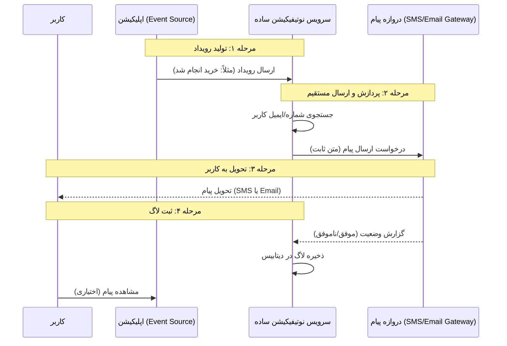

```mermaid
sequenceDiagram
    participant User as کاربر
    participant App as اپلیکیشن (Event Source)
    participant NotifService as سرویس نوتیفیکیشن ساده
    participant Gateway as دروازه پیام (SMS/Email Gateway)

    Note over App, NotifService: مرحله ۱: تولید رویداد
    App->>NotifService: ارسال رویداد (مثلاً: خرید انجام شد)
    
    Note over NotifService, Gateway: مرحله ۲: پردازش و ارسال مستقیم
    NotifService->>NotifService: جستجوی شماره/ایمیل کاربر
    NotifService->>Gateway: درخواست ارسال پیام (متن ثابت)
    
    Note over Gateway, User: مرحله ۳: تحویل به کاربر
    Gateway-->>User: تحویل پیام (SMS یا Email)
    
    Note over User, NotifService: مرحله ۴: ثبت لاگ
    Gateway-->>NotifService: گزارش وضعیت (موفق/ناموفق)
    NotifService->>NotifService: ذخیره لاگ در دیتابیس
    
    User->>App: (اختیاری) مشاهده پیام
```